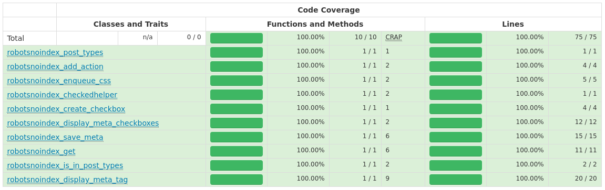
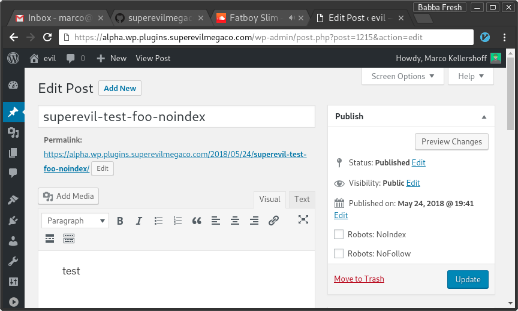

WP-Robots-NoIndex
=================

A WordPress-Plugin for flagging individual pages and/or posts,
so they will output a `<meta name="robots" content="noindex" />` tag.

This tells the search-engines not to index you page/post.

Coverage
--------
This plugin is thoroughly tested using PHPUnit.



Installation
------------

Go to your WordPress installation directory,
then change to `wp-content/plugins`.

Then either run (the preferred way):

```bash
git clone https://github.com/superevilmegaco/wp-robots-noindex.git wp-robots-noindex
```

or (no easy updating via `git` or `git submodules`)
download the latest release from [here][releases]
and unzip its contents to `wp-content/plugins/wp-robots-noindex`.

Then head over to `www.your-wordpress-installation-domain.tld/wp-admin/plugins.php`
and activate the plugin.

Usage
-----

If you don't tick the checkbox (this is the default),
it'll output a `<meta name="robots" content="index,follow"/>` tag,
which tells the search-engines to index your post/page and follow all the
links.



If you happen to have a completely customized theme,
you can simply call this function

```php
<?php
        robotsnoindex_display_meta_tag();
?>
```

### Defaults

This will result in

```html
<meta name="robots" content="index,follow"/>
```

If neither the **Robots: NoIndex**, nor the **Robots: NoFollow** checkboxes
have been ticked.

### NoIndex

If the **Robots: NoIndex** checkbox has been checked, but not the
**Robots: NoFollow** checkbox, `robotsnoindex_display_meta_tag();` will
produce the following output:

```html
<meta name="robots" content="noindex,follow"/>
```

### NoFollow

If the **Robots: NoFollow** checkbox has been checked, but not the
**Robots: NoIndex** checkbox, `robotsnoindex_display_meta_tag();` will
produce the following output:

```html
<meta name="robots" content="index,nofollow"/>
```

### NoIndex, NoFollow

If both the **Robots: NoFollow** and **Robots: NoIndex** checkboxes have been
ticked, `robotsnoindex_display_meta_tag();` will produce the following output:

```html
<meta name="robots" content="noindex,nofollow"/>
```

Advanced Usage
--------------

If you don't want to produce any output, but want to check for the current
status of the post, you can simply call `robotsnoindex_get()`.

```php
<?php
$noindex = robotsnoindex_get(ROBOTSNOINDEX_NOINDEX);
$nofollow = robotsnoindex_get(ROBOTSNOINDEX_NOFOLLOW);
if ($noindex) {
        // noindex is set for this post/page
} else {
        // noindex is NOT set for this post/page
}
if ($nofollow) {
        // nofollow is set for this post/page
} else {
        // nofollow is NOT set for this post/page
}
?>
```


[releases]: https://github.com/superevilmegaco/wp-robots-noindex/releases

