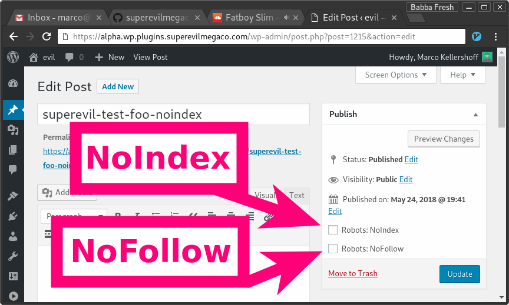

WP-Robots-NoIndex
=================

A WordPress-Plugin for flagging individual pages and/or posts,
so they will output a `<meta name="robots" content="noindex" />` tag.

This tells the search-engines not to index you page/post.

Installation
------------

Go to your WordPress installation directory,
then change to `wp-content/plugins`.

Then either run (the preferred way):

```bash
git clone https://github.com/superevilmegaco/wp-robots-noindex.git wp-robots-noindex
```

or (no easy updating via `git` or `git submodules`)
download the latest release from [here][releases]
and unzip its contents to `wp-content/plugins/wp-robots-noindex`.

Then head over to `www.your-wordpress-installation-domain.tld/wp-admin/plugins.php`
and activate the plugin.

Usage
-----

If you don't tick the checkbox (this is the default),
it'll output a `<meta name="robots" content="index,follow"/>` tag,
which tells the search-engines to index your post/page and follow all the
links.



If you happen to have a completely customized theme,
you can simply call this function

```php
<?php
        robotsnoindex_display_meta_tag();
        // echoes either
        // <meta name="robots" content="noindex" />
        // or
        // <meta name="robots" content="index,follow"/>
?>
```

[releases]: https://github.com/superevilmegaco/wp-robots-noindex/releases

